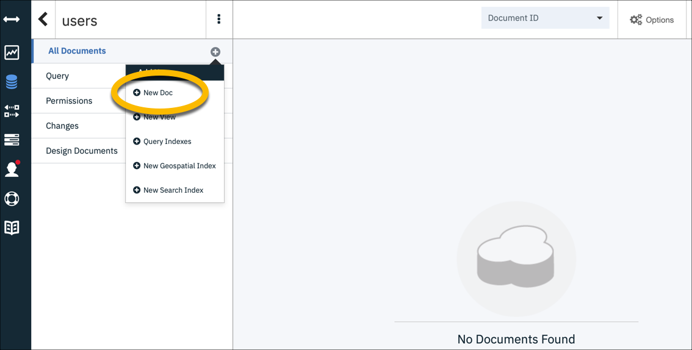

# Increasing retail store revenues using IBM Z hybrid cloud
## Overview

To showcase the business challenges that a typical retail company might be experiencing, we share a case study about a fictitious retail company, which we refer to as **Breadbox Groceries**.  


Today, they run three data centers across the country with IT reaching into the stores and distribution centers as well.  In the data centers, they host their core Business Support Systems on IBM Z. Supporting applications are hosted on IBM CICS® and IBM z/OS® Db2 systems.

One of the initiative for Breadbox was to implement the **virtual shopping list**. With this app, customers will be reminded that they need milk at the store the next time they go based on the purchasing history. 


## Architecture 

This diagram shows the Virtual Shopping List mobile application and two supporting microservices or web services: The Virtual Shopping List List Web Service (vsl-list-ws) and the Virtual Shopping List Recommendation Web Service (vsl-rec-ws).  

* The Recommendation Service is a simple recommendation engine, that finds patterns in customer’s purchases, mostly around durations between purchases, and makes recommendations for new purchases.  

* The List Service supports the mobile phone app (breadboxportal), by managing and persisting the list seen on the mobile phone app, merging in customer added items with customer selected recommendations.  

App users can add or ignore recommendations, can enter free form items, and can delete items at any time.  List Service has the smarts, and uses a  Cloudant database behind it, to maintain the current list.


1. Test the Retail REST API on the Developer Portal
2. Create the Virtual Shopping List mobile app and supporting web services in IBM Cloud
3. Create and populate the mobile app tables in Cloudant
4. Test the Virtual Shopping List mobile app end-to-end

## Included components
  
* [Db2](https://www.ibm.com/analytics/us/en/technology/db2/?lnk=STW_US_SHP_A4_TL&lnk2=learn_DB2)
* [CICS Transaction Server](https://www-01.ibm.com/software/data/enterprise-application-servers/cics/)
* [z/OS Connect Enterprise Edition](https://www.ibm.com/ms-en/marketplace/connect-enterprise-edition) 
* [API Connect](http://www-03.ibm.com/software/products/en/api-connect)
* [IBM Cloud](https://www.ibm.com/us-en/marketplace/cloud-platform)
* [Cloudant](https://www.ibm.com/analytics/us/en/technology/cloud-data-services/cloudant)
* [Watson Analytics](https://www.ibm.com/analytics/watson-analytics/us-en/)

## Steps

### Part 1. Test the Retail REST API on the Developer Portal
1. [Log in to the Developer API portal and prepare the environment](#log-in-to-the-developer-api-portal-and-prepare-the-environment)
2. [Subscribe to the Breadbox API](#subscribe-to-the-breadbox-api)
3. [Work with the Breadbox API](#work-with-the-breadbox-api)

### Part 2. Create the Virtual Shopping List mobile app and supporting web services in IBM Cloud
1. [Ensure prerequisites are met](#ensure-prerequisites-are-met)
2. [Log in to IBM Cloud and prepare the environment](#log-in-to-ibm-cloud-and-prepare-the-environment)
3. [Create three place holder apps in Cloud Foundry](#create-three-place-holder-apps-in-cloud-foundry)

### Part 3. Create and populate the mobile app tables in Cloudant
1. [Create and launch the cloudant database service](#create-and-launch-the-cloudant-database-service) 
2. [Create and populate the mobile app tables in Cloudant](#create-and-populate-the-mobile-app-tables-in-cloudant)
3. [Configure and connect the Virtual Shopping List Cloudant database](#configure-and-connect-the-virtual-shopping-list-cloudant-database)
4. [Create a user-defined environmental variable for the VSL shared secret](#create-the-vsl-app-shared-secret-user-defined-environmental-variable)

### Part 4. Test the Virtual Shopping List mobile app end-to-end
1. [Get the sample code from Github](#get-the-sample-code-from-github) 
2. [Switch to the actual working code](#switch-to-the-actual-working-code)
3. [Log in to the mobile Virtual Shopping List app](#log-in-to-the-mobile-virtual-shopping-list-app)  
4. [Explore the mobile Virtual Shopping List app](#explore-the-mobile-virtual-shopping-list-app)   

# Part 1. Test the Retail REST API on the Developer Portal

Use the API Connect Developer Portal to test the **GET /customerHistory** operation of the Breadbox API.  This operation retrieves customer purchase history and will be used in part two of this journey.

## Log in to the Developer API portal and prepare the environment

1. Sign up for an [IBM ID](https://www.ibm.com/account/us-en/signup/register.html) if you don't have one already.

2. Go to the [Developer API Portal](https://developer-contest-spbodieusibmcom-prod.developer.us.apiconnect.ibmcloud.com/).

3. Create an account if you have not done so already.

   
   
   * Click **Create an account**.
   * Provide all required information.  The email address you use should match the one for your IBM ID.
   * Click **Submit**.
   
   An account activation email will be sent to your registered email. Click on the link in this email to activate your account before. 
   
4. Log in to your account. 

5. Create a new application.  This is a work space for this project.

   
   
   * Click **Apps** from the menu. 
   * Click **Create new app**. 
   * Fill in all required fields. 
   * Click **Submit**.
   
   Make a note of the client ID and client secret. You will need them to access the API later in Part two. 
   
   
   
## Subscribe to the Breadbox API
     
1. Display a list of available API products.
   
   * Click **API Products** from the top menu.
        
   
   
2. Select the **Breadbox** product.
  
   * Click **Breadbox**. 
   
   
   
   From the left navigation panel, you will see one published API named **breadbox team dinosaur**.

3. In order to work with this API, you must subscribe to it first.

   * Click **Subscribe** for the Default Plan.
   * Select the app that you have just created.
   * Click **Subscribe**
   
   
   
   
## Work with the Breadbox API
   
1. Let's take a closer look at this API. 
   * Click **breadbox team dinosaur**
   
   
   
   This page has 3 sections:
   
   * The left panel is the navigation panel that lists all the available operations and their definitions.
   * The middle panel displays detail information for the item you have selected.
   * The right panel contains sample code in various programming languages.    
  
2. This API has one operation: **GET /customerHistory"**.  

   * Click **GET /customerHistory"**.
    
   
    
   This operation retrieves purchase history for a customer. The required parameters and their formats are described.
  
3. Generate code to test this operation.  Go to the right panel.
   
    * Click a programming language that you want to work with.
    
    
    
    Code example in the selected programming language and an example output of a successful response are displayed.  You can copy the code and use it in your own application. 
    
    
    
4. Test the **GET /customerHistory"** operation with the generated code.    
   
   * Scroll down to **Try this operation** section.  
   
   * Fill in the following:
    
   | Field           | Value                      | Comment                                         |
   | --------------- | -------------------------- | ----------------------------------------------- |
   | Client ID       | ID of the application      | Should be defaulted to the one you just created |
   | Client secret   | Secret for the application | Secret generated when app was created           |       
   | customer\_number| 1000100                    | Valid #s are 1000100-1000140                    |
   | request\_date   | 2013-09-01                 | Purchase history since this date                |
   | shorten         | 2                          | Number of records to retrieve                   |       
       
   * Click **Call operation**.
       
   
    
   You should see the output returned at the bottom of the page.
    
   

---

:thumbsup: Congratulations!  You have successfully tested the Breadbox API and ready to move on to part 2 of this journey.

---

# Part 2. Create the Virtual Shopping List mobile app and supporting web services in IBM Cloud

This section takes you through the steps to install the Breadbox Groceries sample mobile web application and associated web services in IBM Cloud.

After creating an IBM Cloud ID, you will create a Cloud Foundry organization and space.  You'll then create Cloud Foundry applications for the recommendation service, listing service, and Breadbox portal.  You'll use the web interface and command line interfaces to perform IBM Cloud commands.

## Ensure prerequisites are met

1. Complete Part 1 above.

2. If you don't have an IBM Cloud account, sign up for one [here](https://cloud.ibm.com).

3. Follow the instructions [here](https://cloud.ibm.com/docs/cli?topic=cloud-cli-getting-started) to install the IBM Cloud CLI tools. 

## Log in to IBM Cloud and prepare the environment 

1. Login to your [IBM Cloud account](https://cloud.ibm.com).

2. If you have not created a Cloud Foundry organization and space yet, do the following:

   1. Create an organization by selecting Manage on the uppermost toolbar and selecting Account from its drop down.  You should see Cloud Foundry orgs on the next screen.  After creating a unique org, you can make a space in that org.
   
     
     * Enter a name for the org.      
     * Click **Create**.
 
    
   
   2. Create a space. 

     * Enter a name for the space.
     * Select **US South** region.
     * Click **Create**.
   
   
    >Important:  Plese choose the **US South** region.  The development tools used in this section were validated with this region only.
   
## Create three place holder apps in Cloud Foundry

Now that the Cloud Foundry org and space are set up, you can proceed with creating applications.

### Create a new App for the Virtual Shopping List Recommendation Web Service (vslrecws). 

1. View the Navigation Menu by clicking the four horizontal lines in the upper left, next to the IBM Cloud logo.  Select Cloud Foundry from its pop up.

   

   Select Create on the Public Applications tile.
   
   
       
2. Select SDK for Node.js.  Then name your app **vslrecws-something-unique**.  Note that your Cloud Foundry organization is pre-filled.
   
   
   
3. When ready, click **Create**.
   
   The app is now Running!    
   
   
   
4. Click **Visit App URL** to test it.
   
   
   
   You have just instantiated a simple template Hello world web application.  
   
### Update the node.js code 
Now that we have a working application, let's use the IBM Cloud command line interface to update it.  Follow the instructions [here](https://cloud.ibm.com/docs/cli?topic=cloud-cli-getting-started) to install the IBM Cloud CLI tools.

1. Download the node.js app code. 
   
   * Click **download the sample code**.        
   * Save the code to your computer.      
   * Unzip the file to a directory.
   
2. Go to a terminal and navigate to the sample code directory.
   
3. Authenticate to IBM Cloud. Substitute your account of password below:
   ```   
   ibmcloud login -u name@example.com -p password
   ```
   For a list of all the ways to authenticate, enter:
   ```   
   ibmcloud login help
   ```
   
4. Set the target Cloud Foundry org.  You can do this in a single command but let's do this interactively for now. Follow the prompts after running the following:
    ```   
    ibmcloud target --cf
    ```  
5. Push the unchanged code for the sample node.js app we created earlier to IBM Cloud.
    ```   
    ibmcloud app push vslrecws-something-unique 
    ```  
    When processing completes, your app will restart.  You should receive messages similar to the following: 
      
    
      
6. Return to the IBM Cloud portal and navigate to the Resource list. You should see the vslrecws app you just created.
      
7. Click on the route to load the URL into your browser to make sure that the node.js sample app is still healthy.
   
    

### Create a new App for the Virtual Shopping List Listing Web Service (vsllistws-something-unique) 

1. Repeat the procedures in the previous step to create the Virtual Shopping List Listing Web Service App.  Name this application vsllistws-something-unique.

### Create a new App for the Breadbox portal (breadboxportal-something-unique).

1. Repeat the procedures in the previous step to create the Breadbox portal App.  Name this application breadboxportal-something-unique.

When these steps are complete, you should see these three apps in your Cloud Foundry Apps list.


# Part 3. Create and populate the mobile app tables in Cloudant

## Create and launch the Cloudant database service

1. From the IBM Cloud main menu:
   * Click **Catalog**.  Make sure the Services tab is selected.
   * Click **Databases**
   * Click **Cloudant**
        
2. Select the **Lite** plan if it is not already selected.

3. Change the Service name to: **cloudantconfig**.
   
4. Choose **Use both legacy credentials and IAM** under the available authentication methods dropdown.
   
   The cloudantconfig instance of the Cloudant NoSQL-DB service is now in place.  You will be redirected to the Resource List while the provision is underway.  After the database is started you should see three apps in Started status and the database in Active status.
   
   

5. Select **cloudantconfig** from the list by clicking on its name. 

6. Click **Launch Cloudant Dashboard** from the Manage tab.
   
   
   
   The Cloudant dashboard opens in a separate browser tab.
      
## Create and populate the mobile app tables in Cloudant

1. It's time to load some data.  Create the **rec** database. This database holds purchase recommendations, based on customer purchase history.
 
   * From the **Database** tab, click **Create Database**.
   
      
   
   * Enter a database name of **rec** (short for recommendation).

   * Select Non-partitioned.  @@@I assume this is right@@@
   
   * Click **Create**.
   
      
   
2. Create the **users** database. This database stores basic user information and breadpoints.

   * From the **Database** tab, click **Create Database**.

   * Enter a database name of **users**.

   * Select Non-partitioned.  @@@I assume this is right@@@

   * Click **Create**.

3. Create the **vsl** database. This database holds shopping list items the user manually adds to their list.   

   * From the **Database** tab, click **Create Database**.

   * Enter a database name of **vsl**.

   * Select Non-partitioned.  @@@I assume this is right@@@

   * Click **Create**.

4. You should now have 3 entries in **Your Databases** tab.
   
   

5. Populate a user in the users database.

   1. Click the **users** database.

   2. Click **All Documents (+)**, select **New Doc**.

      

   3. Copy/paste the sample text below over the existing text:
   ``` 
   {
     "_id": "074",
     "customerid": 1000114,
     "ibmid": "jessejes@example.com",
     "breadpoints": 10,
     "realname": "Jesse JES"
   }
   ```
   
      

      * \_id should be between “001” and “100”.
      * customerid should be between 1000100 and 1000140 (inclusive: 1000100 and 1000140 are valid). 
      * ibmid should be a valid email address.  
      * breadpoints should be a valid number.

   4. When finished, click **Create Document**.

   The new user is now in place.
   
   
   
## Configure and connect the Virtual Shopping List Cloudant database
   
1. Create Cloudant Credentials to use in the Breadbox VSL app.

   * Back to the IBM Cloud portal, Click **Service credentials** in the left navigation pane, and click **New credential**.

      
   
   * Provide a name for the credentials, click **Add**.

      
   
      The credential is now in place.
   
      

   * You can use the **View credentials** Action to view the assigned credential.  These will be used later.

      

2. Connect Cloudant Credentials to the **Breadbox portal** app.

   * Click **Connections** in the left navigation pane, and click **Create connection**.

      
   
   * Select connect next to the **breadboxportal app**.

      

   * Click on the **Connect & Restage** button.

      

      The Cloudant NoSQL DB service is now connected to the breadboxportal app.
   
      

3. Repeat the procedures from the previous step to connect Cloudant Credentials to the **vsllistws** app. 

4. Repeat the procedures from the previous step to connect Cloudant Credentials to the **vslrecws** app.

   You should now have three connected applications in Running status.   
      
   
5. To see the results of this new Connection (for example, Breadbox portal app):

   * From the Cloud Foundry apps listed in the Resource List, click **breadboxportal-something-unique**.  
   
   * Click **Runtime** in the left navigation pane, and click **Environmental variables** in the center selector.
   
   
      
   We see the cloudantNoSQLDB environment variable that will be passed to the breadboxportal Cloud Foundary application, so that credentials don’t need to be in the code.
   
   

## Create a user-defined environmental variable for the VSL shared secret

The environmental variable **JWT_SHARED_SECRET** needs to be identical across breadboxportal, vsllistws, and vslrecws.  This shared secret is used to encrypt and decrypt the JSON web token (JWT) passed between breadboxportal, vslistws and vslrecws.

1. Create the shared secret user defined environmental variable for the breadboxportal app.

   1. Navigate to **Cloud Foundry Apps** / **Breadbox portal App**.
   
   2. Click **Runtime** in the left navigation pane.
   
   3. Click **Environmental variables** in the center selector.
   
      
   
   4. Scroll down to the **User defined** section,  Click **Add**. 
   
      
   
   5. Create a new user-defined environmental variable.  Enter:
   
      * Name: **JWT_SHARED_SECRET**  (must be uppercase). 
      * Value: **{"secret": "20-character-random-string"}** where 20-character-random-string can contain upper, lower case characters and numbers.
    
   6. click **Save**.
 
      
   
      The app will be restarted automatically. 
  
2. Create the shared secret user defined environmental variable for the vsllistws app.

   * Repeat procedures from the previous step. 
   
3. Create the shared secret user defined environmental variable for the vslrecws app.  
   
   * Repeat procedures from the previous step. 
  
# Part 4. Test the Virtual Shopping List mobile app end-to-end
	 
In this section, you are going to upload the actual working code, to overlay the placeholders created earlier. Before proceeding, you must modify a few files to match your specific environment.  

## Get the sample code from Github
 
1. In a terminal on your computer, move to the **home** directory. 
   ```
   cd $HOME 
   ```
2. If not already installed, install a Git client for your computer.  Visit the Git webpage for details on how to install on your platform.

3. Once Git is installed, run the following command to clone the needed materials for this exercise. 
   ```
   git clone https://github.com/IBM/increase-retail-revenues-leveraging-hybrid-cloud-on-mainframes.git
   ``` 
4. Change to the directory that you just created:
   ```
   cd increase-retail-revenues-leveraging-hybrid-cloud-on-mainframes/vsl
   ```
   There should be 3 directories contained inside the vsl directory:
   * breadboxportal
   * vsllistws
   * vslrecws

## Switch to the actual working code 

1. Modify files in the breadboxportal directory.

   1. Change your focus to the **breadboxportal** directory.
      ```
      cd breadboxportal
      ``` 
   2. Edit the **manifest.yml** file.  Replace the **host:** parameter with the URL (route) for your breadbox portal app.  
   
      
   
   3. Edit the **server.js** file. Replace the **listService** parameter with URL (route) for your vsl listing web service app.  
   
      
   
2. Modify files in the vsllistws directory.
   
   1. Move to the **vsllistws** directory.
      ```
      cd vsllistws 
      ```
   2. Edit the **manifest.yml** file. Replace the **host:** parameter with the URL (route) for your breadbox portal app.  
   
      
   
   3. Edit the **server.js** file. Replace the **var recsServer** parameter with the URL (route) for your vsl recommendations web service app.  
   
      

3. Modify files in the vslrecws directory.

   1. Move to the **vslrecws** directory.
      ```
      cd vslrecws 
      ```
   2. Edit the **manifest.yml** file. Replace the **host:** parameter with the URL (route) for your vsl recommendations web service app.  
   
      
            
   3. Edit the **server.js** file.  
      ```
      Find the section that calls **analyze-history**.
      Replace the value for **'x-ibm-client-id'** with the one you created in Part 1.
      Relace the value for **'x-ibm-client-secret'** with the one you per created in Part 1.
      ```
     
      
      
4. Authenticate to IBM Cloud. Substitute your account of password below:
   ```   
   ibmcloud login -u name@example.com -p password
   ```
   For a list of all the ways to authenticate, enter:
   ```   
   ibmcloud login help
   ```
   
5. Upload the actual working code and overlay the placholder for your breadbox portal app.
   
   1. Navigate to the breadboxportal directory.
   
   2. Push the code to IBM Cloud.  Enter: 
      ```
      ibmcloud app push breadboxportal-something-unique
      ```     
      The following shows an example of a successful run.
      
      
      
6. Upload the actual working code and overlay the placholder for your vsl listing web service app.
   
   1. Navigate to the vsllistws directory.
   
   2. Push the code to IBM Cloud.  Enter:
      ```
      ibmcloud app push vsllistws-something-unique
      ```
     
7. Upload the actual working code and overlay the placholder for your vsl recommendation web service app.
   
   1. Navigate to the vslrecws directory.
   
   2. Push the code to IBM Cloud. Enter:
      ```
      ibmcloud app push vslrecws-something-unique
      ```   
> IMPORTANT:  When issuing the ibmcloud cf push commands, it's very important to issue the commands for a given application from within the directory for that application.  If this is not done, application hosts get cross wired, and your applications will start to be unreachable intermittently, as IBM Cloud seems to associate multiple routes with the same application, when a cross wired push is done.  If cross wiring occurs, the IBM Cloud portal can be used to edit the application routes, and delete unintended routes.  Use the Routes button in the upper left corner of any detailed views (Overview, Runtime, Logs, etc.) for the application.
 
8. As a quick check for proof that the actual working Breadbox Recommendation Service is running.  
   
   1. Click on the URL for the vslrecws app.  You should see something like this if all is well:
   
      

## Log in to the mobile Virtual Shopping List app

Now we are ready to see the final result, the full hybrid cloud application from IBM Cloud all the way back to z/OS Connect.
 
1. Navigate to the breadboxportal app in IBM Cloud.  

2. Click the **Route** host you created before for the breadboxportal app.  You should see:

   

3. Click the Login button at the bottom of the screen above. 

   

   This sample portal, mobile application lacks user login.  Developers may choose to add user login themselves.  The sample redirects directly to the mobile application screen.  

## Explore the mobile Virtual Shopping List app

1. Select the Virtual Shopping List app on the mobile phone.  (Click on the simulated mobile device as if you are touching it with your finger.)

   

   The top two rows are recommendations coming from the Recommendation web service based on the customer purchase history coming from z/OS Connect!
    
   
  
2. You can use the plus (+) sign to add recommendations to your shopping list.  The shopping list is persisted in the cloud, in the Cloudant database.

   

3. To get further validation that our integration of the engaging mobile app in the cloud, with the customer purchase history on IBM Z, you can double check the Recommendation web service log in IBM Cloud to see the recommendations coming from the analyze-history call. 

   

4. We can also see the raw response from the API on the Developer Portal.

   

5. The cloudant "users" “rec” and “vsl” databases are self-priming, based on use of the portal mobile app.  Using the Cloudant management UI, you can see that the databases are working properly. 
   
   1. Navigate back to the Cloud management UI, and navigate to the Databases view.  

   2. Select the **users** table. Click the pencil in the upper right to view/edit the document.
 
      
  
      Jesse now has 12 breadpoints!

   3. Select the **rec** table. Click the pencil in the upper right to view/edit the document. Similarly, the recommendations for Jesse JES (_id=1000114) are in this database.

      
    
   4. Select the **vsl** table. Click the pencil in the upper right to view/edit the document. The items that Jesse JES added manually to his virtual shopping list are now in this database.

      
      
---

:thumbsup: Congratulations!  You have successfully completed deployment of the Virtual Shopping List web application. 

<!-- keep this -->

## License

This code pattern is licensed under the Apache License, Version 2. Separate third-party code objects invoked within this code pattern are licensed by their respective providers pursuant to their own separate licenses. Contributions are subject to the [Developer Certificate of Origin, Version 1.1](https://developercertificate.org/) and the [Apache License, Version 2](https://www.apache.org/licenses/LICENSE-2.0.txt).

[Apache License FAQ](https://www.apache.org/foundation/license-faq.html#WhatDoesItMEAN)